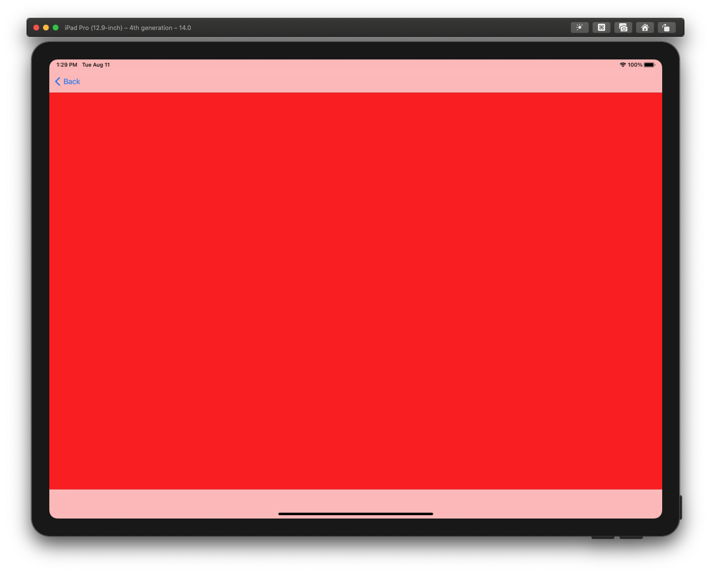
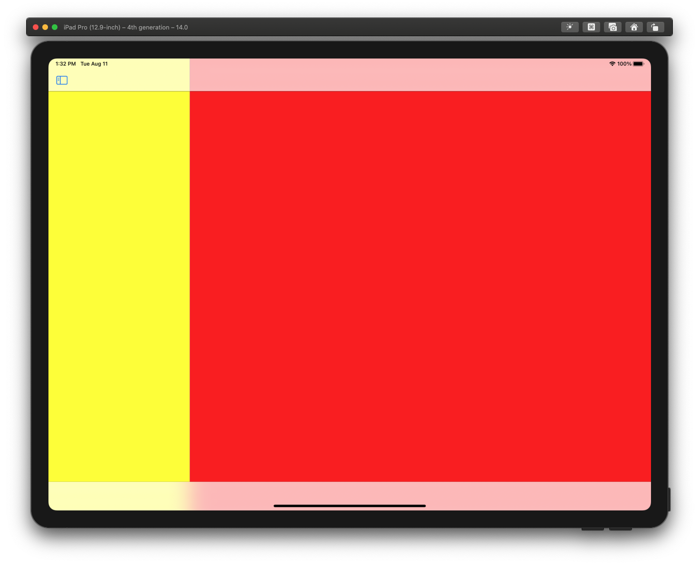

# Feedback Assistant Issue FB8349717

### Please provide a descriptive title for your feedback:
On iPadOS 14, UISplitViewController embedded in UITabBarController is always collapsed

### Which area are you seeing an issue with?
UIKit

### What type of feedback are you reporting?
Incorrect/Unexpected Behavior

### Description
On iPadOS 14 (beta 4), UISplitViewController embedded in UITabBarController is always collapsed, preventing to display 2 or 3 columns side by side.

1. Create a `UISplitViewController` with a `doubleColumn` or `tripleColumn` style.
2. Set its `preferredDisplayMode` to `.oneBesideSecondary` (or `.twoBesideSecondary` for the `tripleColumn` style).
3. Embed the split view controller in a `UITabBarController`.
4. Launch the app on iPad. 

- Expected behavior: both the primary and secondary view controllers should be displayed side by side (expanded interface).
- Actual behavior: only the secondary view controller is displayed in the `UITabBarController` (collapsed interface). 

5. Print the split view controller `horizontalSizeClass`. 
It is `.compact`. It should be `.regular`. That is why the split view controller is collapsed instead of expanded.

This is a regression. Embedding a `UISplitViewController` in a `UITabBarController` works well on iOS 13 (and before).

**Actual Behavior**:

**Expected Behavior:**

